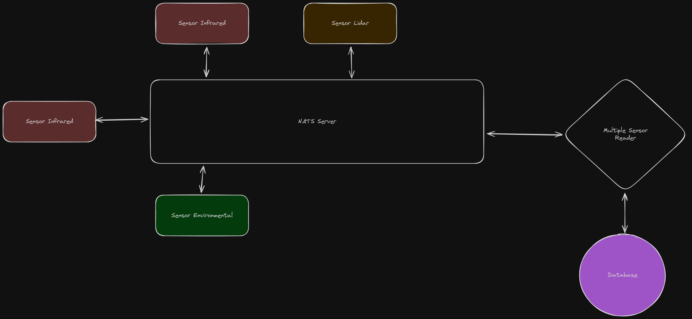
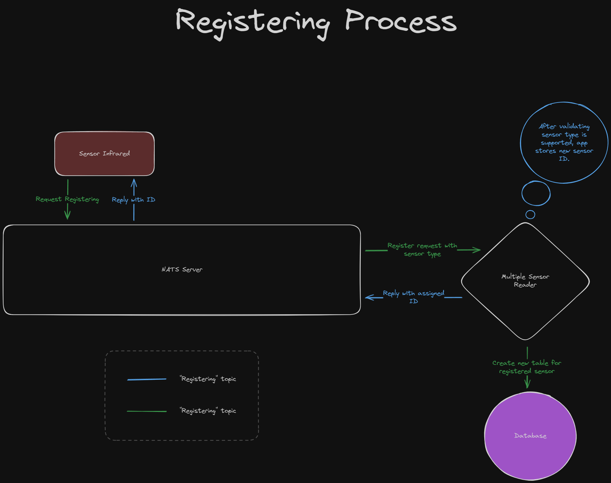
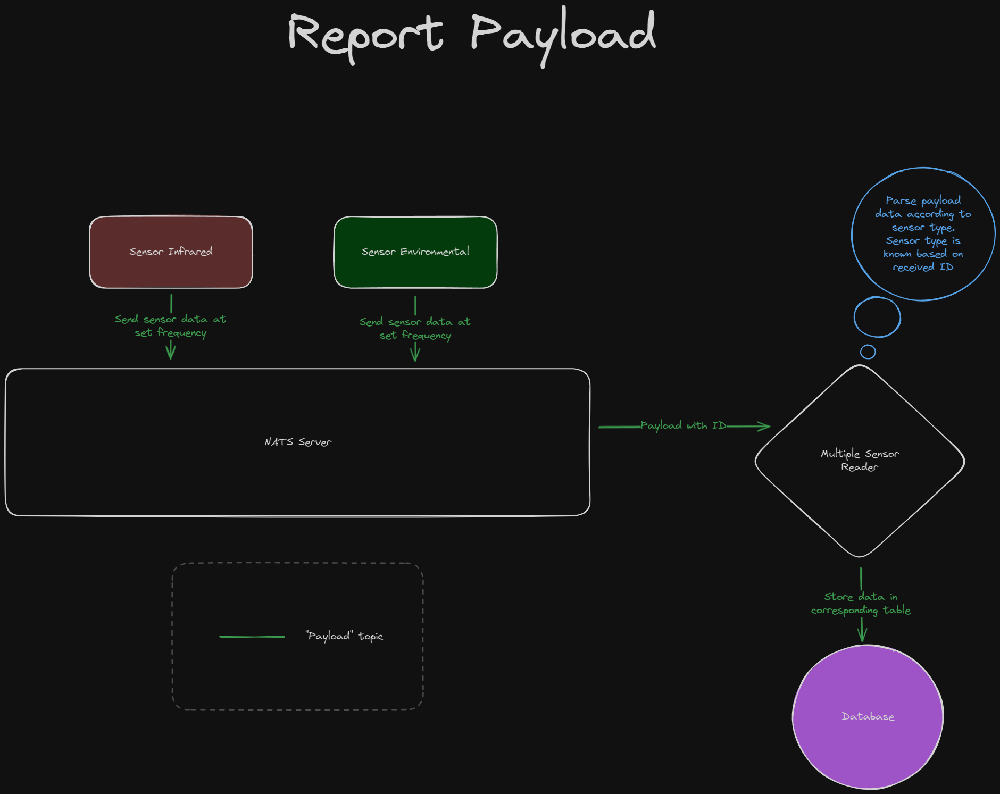
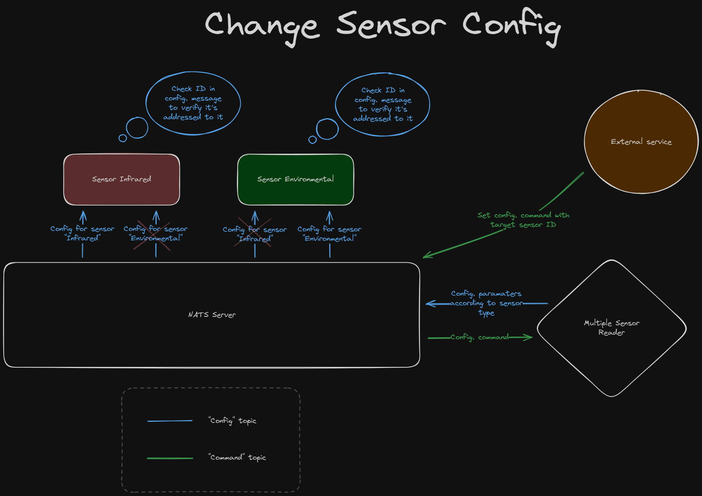

# Multiple Sensor Reader: task 2

## Main APP Description

Communication between the components of the system is performed by using a messaging server based on NATS. There are four main topics:

- `Registering`
- `Config`
- `Payload`
- `Command`

The main logic of the system works as follows:

1. Sensors need to send a message through the topic `registering`. This message must contain the sensor type. Once the application verifies the requester sensor's type is listed on the supported types, it stores the sensor in the list of registered sensors (`sensors_registered`) and assigns an ID to it. This ID is replied to the requester sensor, so it can use it to be identified.

	
	
2. Once a sensor has been registered, it can send payload messages using the topic `payload`. The message should contain: 
	- ID: previously assigned to the sensor in order to be identified and processed, and the corresponding payload data depending on the sensor type.
	- Payload: sensor data, which is parsed on the app-side using the corresponding structure.

	
	
3. Changes to configuration parameters of each registered sensor can be done by sending messages through the topic `config`. These messages contain all config. parameters according to target sensor type, and include the target sensor ID. All sensors are subscribe to `config` topic, so once a message is received they check the ID set on the message with their own stored ID, in order to verify whether a message is addressed to them or not.

	

## Usage
The provided code is partially functional. Registering and report of payload sensor data can be executed. Three types of sensor have been implemented as showcase, however
only two of them were tested running (Infrared, Environmental). Set config. parameters and save data to database is only described and pseudo-code is provided, but it's not functional.